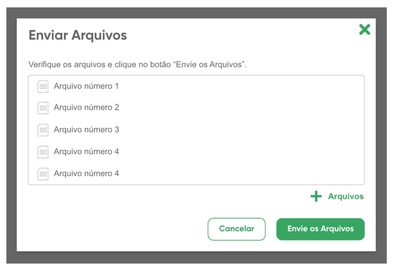
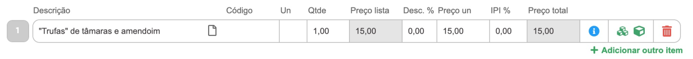

# Components / Action Link

	

		
Action Link

	

	

		É um botão para executar uma determinada ação, adicionar um item, atualizar uma listagem, anexar
	um arquivo...etc
	

	

		

			<h4>Normal</h4>
			<a class="plus-sign " href="#"> Action link</a>
		

		

			<h4>Desabilitado</h4>
			<a class="plus-sign" href="#"> Action link</a>
		

		

			<h4>Hover</h4>
			<a class="icon-plus" href="#"> Action link</a>
		

	

	

		<h5>Regras de uso no Bling</h5>
	

	

		Esse componente é usado em listagens dentro de modais ou páginas. É recomendado seu uso
		quando já existe na interface um CTA e um secundar button.
	

	

		<b>EXEMPLOS:</b>
	

	

		
	

	

		
	

