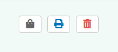
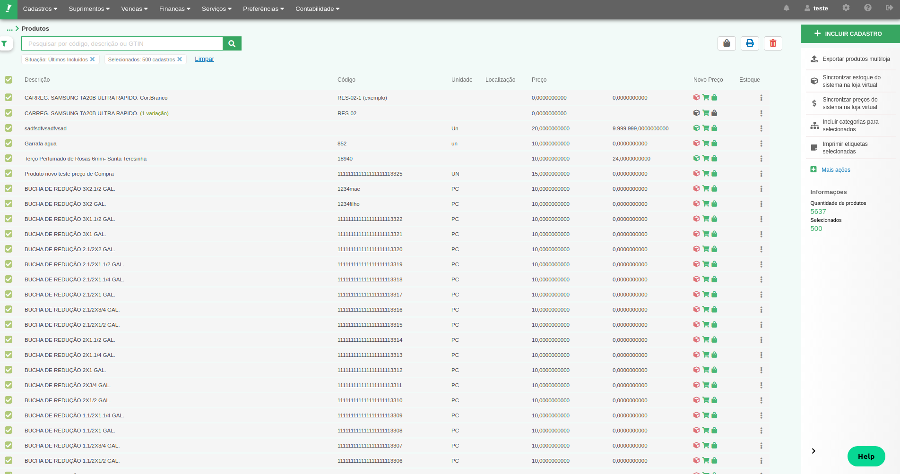

# Components / Action List

<div class="bling-form mdc-layout-grid mdc-layout-grid__inner">
	<div class="mdc-layout-grid__cell--span-12">
		<p>Action List</p>
	</div>
	<div class="explicacao mdc-layout-grid__cell--span-12">
		Esse botão possibilita que o usuário possa escolher outras ações de mesma natureza. Também
		pode ser usado para um conjunto de ações que não cabem no espaço disponível na tela.
	</div>
	<div class="mdc-layout-grid__cell--span-12">
		
	</div>
	<div class="mdc-layout-grid__cell--span-12">
		<h4>Regras de Uso no Bling</h4>
	</div>
		<div class="explicacao mdc-layout-grid__cell--span-12">
			Esse componente é usado em listagens dentro de modais ou páginas com data table se precisar.
		</div>
		<div class="explicacao mdc-layout-grid__cell--span-12">
			<h4>Como usar</h4>
		</div>
		<div class="explicacao mdc-layout-grid__cell--span-12">
			O "CommonActions" usado no código a baixo, é um objeto de "Filter", funciona como uma lista de objetos. Cada objeto dessa lista representa respectivamente uma funcionalidade: <b>Sacola de Compras</b>, <b>Imprimir Relatório</b> e <b> Excluir os Produtos Selecionados</b>
		</div>
	</div>
	<div>
		```
		commonActions:[
			{
				icon: 'fas fa-shopping-bag',
				title: 'Sacola de compras',
				dataSystemAction: 'SacolaCompras',
				id: 'sacola_compras'
			},
			{
				icon: 'fas fa-print',
				title: 'Imprimir',
				class: 'act-relatorio'
			},
			{
				icon: 'fas fa-trash-alt',
				title: 'Excluir os produtos selecionados',
				dataSystemAction:'ProdutosRegistroEX',
				class:'act-excluir'
			}
		]
		```
	</div>
	<div class="common descricao mdc-layout-grid__cell--span-7">
		Exemplo a baixo: Essa opção é utilizada na listagem principal
	</div>
	<div class="mdc-layout-grid__cell--span-10 common">
		
	</div>
</div>