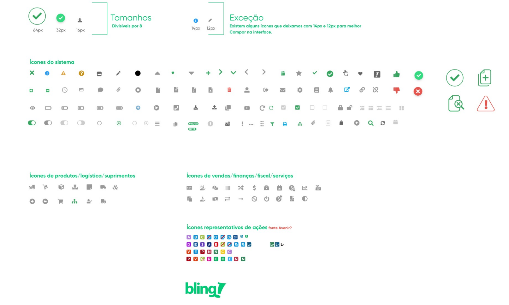

# Design/Ícones

	

		
Ícones

	

	

			Os ícones do Bling atuam como recursos visuais para ajudar os usuários a completar
			tarefas. Eles devem ser usados com propósito.
	

	
	

		

			<h4>ÍCONES BLING</h4>
			<h4>Encontre os ícones de que você precisa verificando no nesse link do XD:</h4>
			<a href="https://xd.adobe.com/view/3c12767d-3d9d-497c-a5dd-175b407a2548-6941/specs/">https://xd.adobe.com/view/3c12767d-3d9d-497c-a5dd-175b407a2548-6941/specs/</a>
		

		

			
		

	

